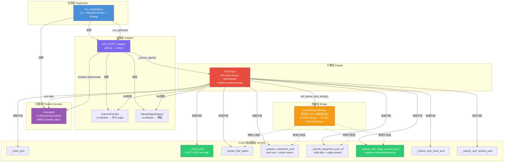
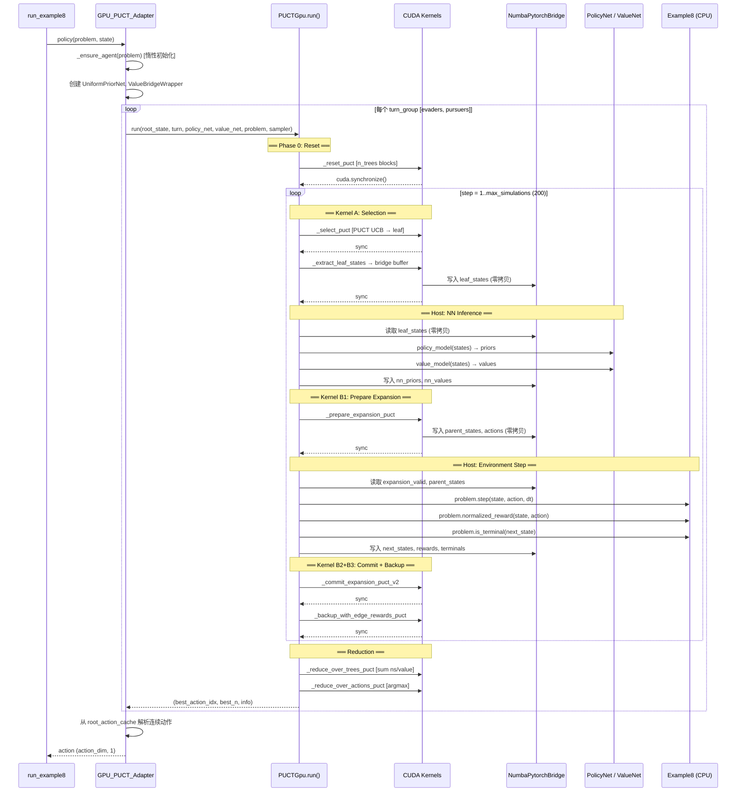
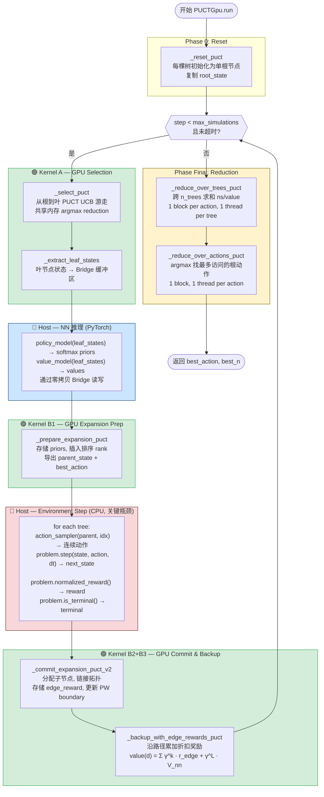
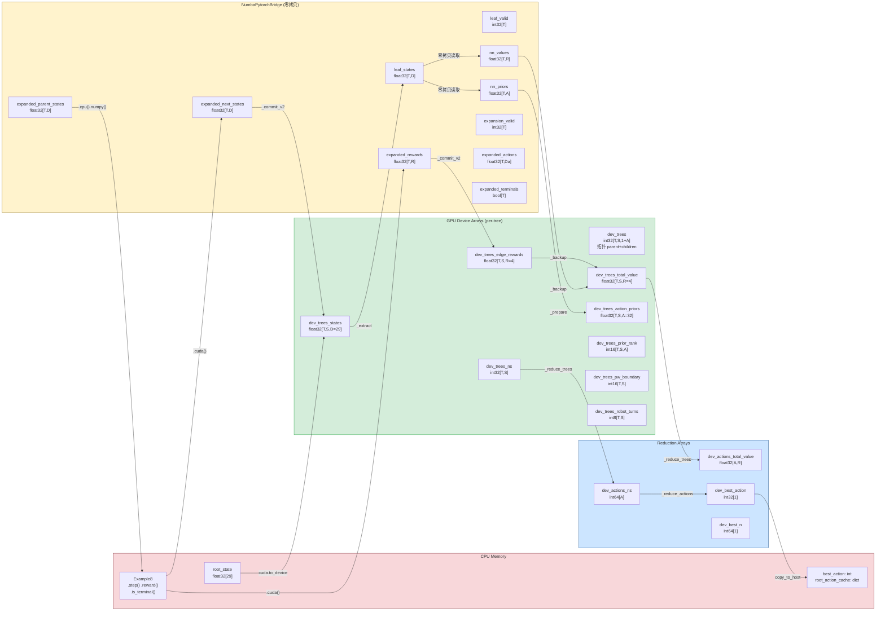
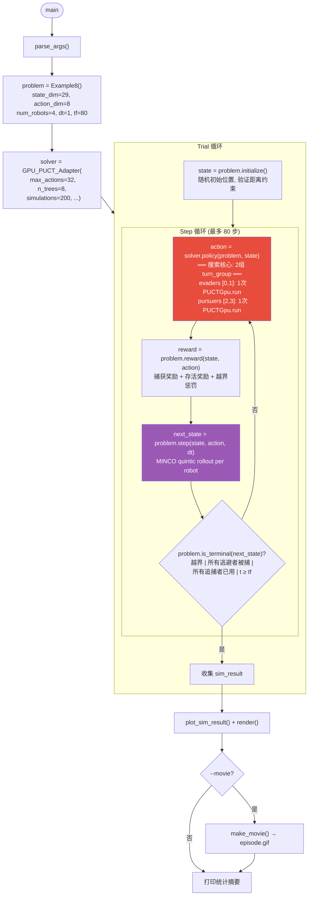

# GPU PUCT MCTS 框架架构分析

> 入口点: `run_example8.py` → 追逐-逃避 (Pursuit-Evasion) 多智能体博弈

---

## 1. 项目文件结构

| 文件 | 职责 | 层级 |
|------|------|------|
| [run_example8.py](file:///home/robomaster/Research/mcts_numba_cuda/src/run_example8.py) | CLI 入口、Episode 循环、绘图/动画 | 应用层 |
| [example8_adapter.py](file:///home/robomaster/Research/mcts_numba_cuda/src/examples/example8_adapter.py) | GPU PUCT ↔ Problem 适配层 | 适配层 |
| [example8_problem.py](file:///home/robomaster/Research/mcts_numba_cuda/src/examples/example8_problem.py) | 追逐-逃避博弈逻辑 (4 机器人, MINCO 轨迹) | 问题域 |
| [puct_gpu.py](file:///home/robomaster/Research/mcts_numba_cuda/src/puct_gpu.py) | PUCTGpu 搜索引擎 (主循环 + GPU 调度) | 引擎层 |
| [puct_gpu_kernels.py](file:///home/robomaster/Research/mcts_numba_cuda/src/puct_gpu_kernels.py) | 全部 `@cuda.jit` 核函数 | CUDA 核函数层 |
| [puct_gpu_nn_bridge.py](file:///home/robomaster/Research/mcts_numba_cuda/src/puct_gpu_nn_bridge.py) | Numba ↔ PyTorch 零拷贝 GPU 共享内存桥 | 桥接层 |
| [puct_gpu_mechanics.py](file:///home/robomaster/Research/mcts_numba_cuda/src/puct_gpu_mechanics.py) | Device 函数 (双积分器 demo, 非 example8 使用) | 设备函数层 |

---

## 2. 组件关系图

---

## 3. 时序图 — 单步 `policy()` 调用

---

## 4. 三明治迭代流程图 (核心搜索循环)

> [!IMPORTANT]
> **关键路径**: Host Environment Step 是计算瓶颈 — 每棵树的 `problem.step()` 顺序执行在 CPU 上

---

## 5. 数据流图 — GPU 内存与 CPU 交互

---

## 6. Episode 主循环流程图

---

## 7. 关键架构特征总结

### 三明治 (Sandwich) 迭代模式

每轮模拟迭代是一个 **GPU → CPU → GPU** 三明治：

| 阶段 | 执行位置 | 核函数/函数 | 耗时 |
|------|---------|------------|------|
| Selection | GPU | `_select_puct` + `_extract_leaf_states` | ~μs |
| NN Inference | GPU (PyTorch) | `policy_model()` + `value_model()` | ~μs (均匀先验) |
| Expansion Prep | GPU | `_prepare_expansion_puct` | ~μs |
| **Env Step** | **CPU** | `problem.step()` × n_trees | **~ms (瓶颈)** |
| Commit+Backup | GPU | `_commit_v2` + `_backup_with_edge_rewards` | ~μs |

> [!WARNING]
> **关键瓶颈**: Environment Step 在 CPU 上顺序执行 `n_trees` 次 `problem.step()`，涉及 MINCO 矩阵求逆。这是整个搜索循环中最慢的部分。

### 零拷贝桥接 (NumbaPytorchBridge)

- PyTorch 拥有 GPU 内存，`cuda.as_cuda_array()` 创建 Numba 视图
- CUDA 核函数直接写入 → PyTorch 直接读取，**无 PCIe 往返**
- 12 个共享缓冲区覆盖：叶状态、先验、值、扩展数据

### Progressive Widening

子节点延迟扩展：`pw_boundary = ceil(C_pw × N^alpha_pw)`，最大不超过 `max_actions`。
先验排序 (insertion sort on GPU) 决定扩展优先级。

### 根并行 (Root Parallelism)

`n_trees=8` 棵独立树并行搜索，最终通过两级 reduction 合并：
1. `_reduce_over_trees`: 每个 action 跨树求和 ns/value
2. `_reduce_over_actions`: argmax 选最多访问动作

### Turn Group 机制

`turn_groups = [[0,1], [2,3]]` — evaders 共享一次搜索，pursuers 共享一次。
每个 `policy()` 调用执行 **2 次完整 PUCTGpu.run()**。
