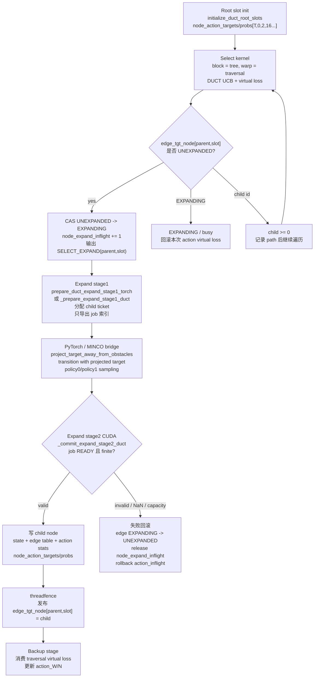
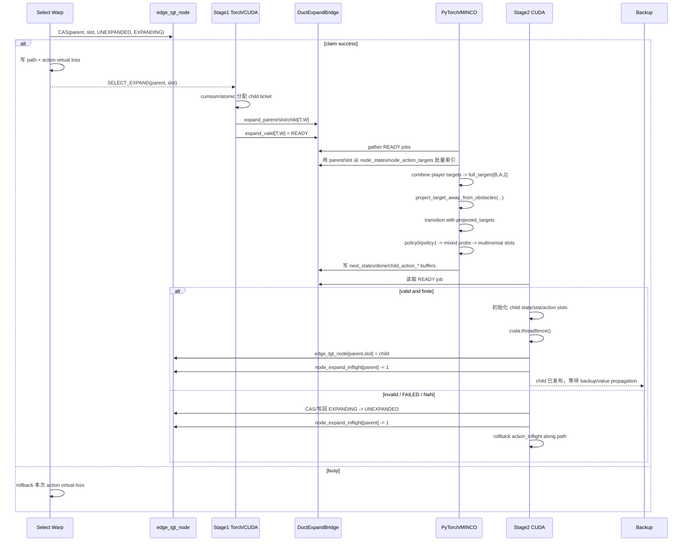
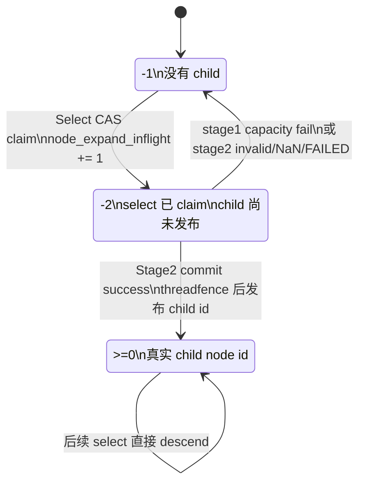
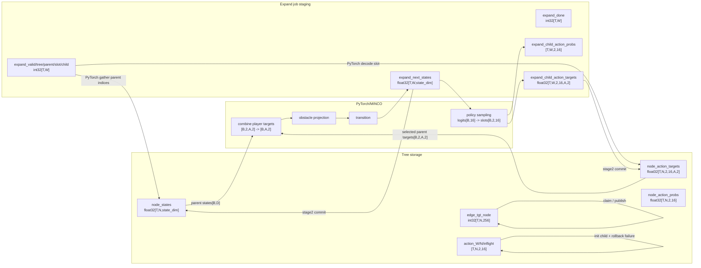
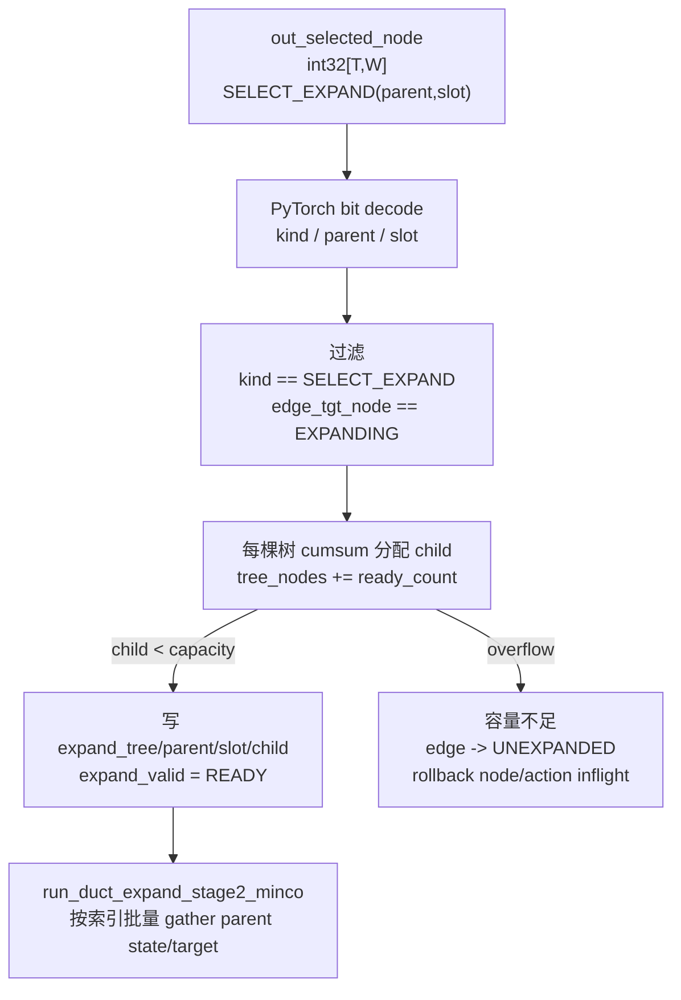
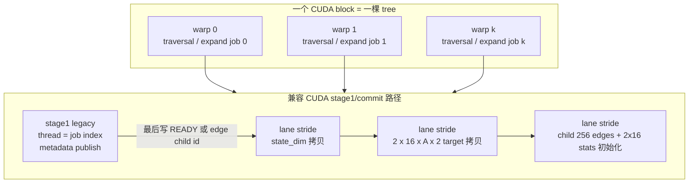

# GPU MCTS Kernel Design Principles

这份笔记记录当前 `puct_gpu_v3_duct.py` 重构中沉淀下来的通用 CUDA kernel 设计规则。
目标是给后续 MCTS 功能实现复用，尤其是 `Select`、`Rollout`、`Extend`、`Backup` 等阶段。

## 1. 先定义并行所有权

每个 kernel 开始设计前，先回答四个问题：

| 问题 | 推荐答案示例 |
|---|---|
| 一个 block 负责什么 | 一棵 tree，一个 env batch，或一个 node pool 分片 |
| 一个 warp 负责什么 | 一次 traversal，一条 rollout trajectory，一个 parent edge extend |
| 一个 lane 负责什么 | 一个 action、一个 agent、一个 candidate、一个 state 维度或一个 reduce 元素 |
| 哪些数据只能由 owner 写 | child slot、node id、path step、RNG state、inflight counter |

不要先写串行逻辑再想办法并行化。先把任务拆成 lane/warp/block 的所有权，再写实现。

## 2. 固定 ID 优先于动态分配

能用确定映射时，不要用全局扫描或全局计数器。

例子：

```text
joint_slot = (action0 << 4) | action1
action0 = joint_slot >> 4
action1 = joint_slot & 15
```

固定 ID 的好处：

- 定位 O(1)，避免扫描 `node_expanded` 或 `cur_expanded`。
- 冲突点明确，每条 edge 只需要 CAS 自己的 slot。
- Rollout/Extend/Backup 可以直接通过 path 编码还原 parent/action。
- 可视化和测试更容易解释。

只有在真实需要从 pool 中分配新 node id 时，才使用 ticket/counter。

## 3. 用状态机表示并发边界

共享对象必须有明确状态机，不能靠隐式约定。

Joint edge 的例子：

```text
-1: 未扩展，没有 child
-2: 已有 warp 抢到 Extend 权限，child 尚未提交
>=0: child node id，后续 select 可以继续遍历
```

通用规则：

- `UNEXPANDED -> EXPANDING` 必须用 CAS。
- `EXPANDING -> child_id` 只能由 Extend/commit owner 写。
- 发现 `EXPANDING` 时不能继续读 child。
- 失败路径必须回滚自己放下的 virtual loss / inflight。

Rollout/Extend 也应使用类似的状态机，例如：

```text
rollout_job_state: EMPTY -> CLAIMED -> DONE
extend_job_state: EMPTY -> CLAIMED -> COMMITTED
node_eval_state: UNEVALUATED -> EVALUATING -> READY
```

## 4. 把统计视角和扩展视角分开

DUCT 中的关键教训：

- 统计视角是每个玩家自己的 marginal action。
- 扩展视角是 joint edge 是否已经有 child。

不要因为 tree 里存的是 joint edge，就把所有统计都绑到 joint edge 上。
反过来也不要因为统计是 marginal action，就让 Extend 失去 joint edge 的唯一归属。

通用到其他阶段：

- Rollout 关注 state transition batch，不应该携带 select 阶段不需要的完整统计。
- Extend 关注 parent edge 到 child node 的提交，不应该重新做 select 决策。
- Backup 关注 path 上哪些统计要更新，不应该重新解释环境转移。

## 5. Progressive Widening 是访问窗口，不是扩展计数

PW 的含义应是“当前允许访问前多少动作或候选”，而不是“当前已经扩展了多少 child”。

推荐协议：

1. 每个 decision dimension 独立计算 allowed window。
2. Select 只能从 allowed window 中选 action。
3. 选出的 joint/action 如果没有 child，则进入 Extend。
4. Extend 成功后才创建真实 child。

这样可以避免全局 `cur_expanded` 和固定 joint slot 设计互相冲突。

## 6. Claim / Commit / Release 三段式

涉及共享写入的 kernel 都应显式分成三段。

| 阶段 | 责任 |
|---|---|
| Claim | 用 CAS/ticket 抢唯一权限，放置 virtual loss 或 job marker |
| Commit | owner 写真实结果，例如 child id、state、reward、done、eval value |
| Release | 成功后清理 inflight，失败后回滚到一致状态 |

Select 的例子：

- Claim action inflight。
- Claim joint edge expand 权限。
- 写 path。
- 返回 `SELECT_EXPAND`。
- 后续 release/extend 负责清理或提交。

Extend 的建议：

- 输入必须包含 parent node、joint/action、claim marker。
- 成功后写 child state、reward、done、edge_tgt_node。
- 失败或非法 transition 必须写明确 sentinel，不能留下半提交 child。

## 7. 原子操作只保护必要的不变量

原子操作不是越少越好，而是只放在真正需要保护的不变量上。

推荐：

- 多动作竞争时，用 action/edge inflight + CAS 做 winner recalc。
- 单动作侧没有可重选空间时，不要用 CAS 制造阻塞，直接 atomic add virtual loss。
- joint edge child 权限必须 CAS，因为它决定唯一 child。
- node pool 分配必须 atomic add ticket，因为它决定唯一 node id。

避免：

- 每个 lane 都写同一个地址。
- 先 `if lane == 0` 再 `if lane == 16` 写两段串行代码。
- 过早把多个语义不同的 counter 合并成一个全局 counter。

## 8. Warp 内并行模式

优先使用 warp/half-warp 原语表达并行结构。

常用映射：

| 场景 | 推荐模式 |
|---|---|
| 两个玩家各 16 动作 | 一个 warp 切成两个 half-warp |
| top-k 动作 | half-warp bitonic sort 或并行 selection |
| top4 x top4 joint 候选 | lane 0..15 各检查一个 pair |
| 多 agent 小规模归约 | 每个 agent 一组 lane，然后 shuffle reduce |
| path rollback | lane 按 stride 遍历 path step |

规则：

- top-k 不要聚合到单 lane 后串行检查。
- 需要 top-4，就让 rank 0..3 的 lane 持有结果。
- 需要 16 个候选，就让 16 个 lane 同时检查。
- `FULL_MASK` shuffle 必须保证整个 warp 都执行到同一条指令。
- half-warp 内 shuffle 使用对应 mask，例如低 16 lane 和高 16 lane 分开。

## 9. 控制寄存器占用

每个 lane 只保存自己语义需要的数据。

好的模式：

- player0 lane 只持有 player0 action/score/inflight。
- player1 lane 只持有 player1 action/score/inflight。
- 需要组合 joint action 时，用 shuffle 临时读取另一侧 winner。

坏的模式：

- 每个 lane 同时持有两个玩家的 action、score、inflight。
- 为了方便调试把所有候选 top-k 都复制到每个 lane。
- 在热路径保留只给 fallback 使用的大量临时变量。

## 10. 热路径和异常路径分层

主路径必须短：

```text
load state -> compute score -> claim -> inspect child -> continue or return
```

较重逻辑只能放在明确的异常/soft 路径里：

- winner CAS 失败后的 soft winner。
- edge 正在扩展时的 soft expand fallback。
- invalid/OOB 的 rollback。
- debug/visualization 输出。

这条规则对 Rollout/Extend 同样重要：

- Rollout 热路径只做环境转移和 reward/done。
- Extend 热路径只做 child 分配和提交。
- fallback、repair、统计诊断放到单独 kernel 或宏开关路径。

## 11. Rollout Kernel 设计建议

Rollout 关注批量状态转移，通常比 select 更适合 data-parallel。

推荐结构：

```text
block/warp -> rollout job
lane       -> agent/action dimension/state component/collision pair
```

设计规则：

- host 侧预计算固定几何、动力学矩阵、pair index、mask。
- kernel 输入只传 parent state、action/target、job id。
- 不要在 rollout 中重新做 tree select。
- 每个 rollout job 写独立 output slot，避免原子写。
- RNG state 必须按 job/lane 独占，不能多个 warp 共享同一 RNG state。
- 可行性、碰撞、done、reward 用并行 reduce 得出。
- 对小规模 agent/collision pair，优先用 warp 内 lane 并行，而不是 lane0 串行循环。

常见输出：

```text
next_state[job]
reward[job, player]
done[job]
valid[job]
transition_code[job]
```

## 12. Extend Kernel 设计建议

Extend 负责把 Select/Rollout 的结果提交到 tree。

推荐结构：

```text
block/warp -> one expand/extend job
lane       -> state element / action decode / child init field
```

设计规则：

- Extend 只处理已经 claim 的 edge/job。
- child node id 从 node pool ticket 分配。
- parent edge 从 `EXPANDING` commit 到 `child_id`。
- state/reward/action/done 写入必须先完成，再公开 child id。
- 如果 rollout invalid，写失败状态并释放 claim，不要发布半初始化 child。
- 多字段写入时使用 owner lane 发布 final sentinel，其他 lane 只写 data field。

推荐提交顺序：

```text
1. allocate child node id
2. write child state/action/reward/done
3. initialize child statistics
4. memory-order safe point if needed
5. publish edge_tgt_node[parent, slot] = child
6. release node_expand_inflight
```

## 13. Backup Kernel 设计建议

Backup 关注 path 上的统计更新。

规则：

- path 中必须保存足够的反向更新信息，不要 backup 时重新推断 action。
- 单人 PUCT 可以保存 edge id；DUCT 需要保存每个玩家动作。
- lane stride 遍历 path，避免 lane0 串行回放整条路径。
- atomic add/sub 只作用于对应统计项。
- reward/value 的折扣、符号翻转或玩家视角转换要在一个地方定义清楚。

## 14. 可测试性和可视化

每个新 kernel 至少覆盖以下场景：

- fresh expand / extend 成功。
- 已有 child 的正常路径。
- busy/inflight 冲突。
- invalid/OOB 输入。
- depth limit 或 job capacity limit。
- 多 warp 是否能分散到多个动作/edge。
- 单动作侧是否不会无意义阻塞。
- rollback/release 后 inflight 总和回到 0。

可视化应区分：

- 实际 child edge。
- candidate / visual-only edge。
- `EXPANDING` edge。
- path edge。
- exit reason。
- inflight summary。

不要只看最终 kind，必须看 path、edge state、inflight 和 reason。

## 15. 实现前检查表

写新 MCTS kernel 前先填这张表。

| 项目 | 问题 |
|---|---|
| 并行粒度 | block/warp/lane 分别负责什么 |
| 数据所有权 | 哪些字段由谁写，是否唯一 owner |
| 状态机 | 空、claim、busy、done、invalid 分别怎么表示 |
| 原子操作 | 哪些不变量必须 CAS/ticket，哪些只需普通写 |
| 回滚路径 | claim 后失败如何释放 |
| path/job 编码 | 后续 kernel 是否能无歧义消费 |
| 热路径 | 是否避免了 fallback/top-k/debug 变量污染 |
| warp 原语 | shuffle mask 是否和参与 lane 一致 |
| 单动作/单候选边界 | 是否会被 CAS 人为卡住 |
| 测试 | 是否覆盖多 warp、busy、invalid、release |
| 可视化 | 是否能解释每个 warp 的退出原因 |

## 16. 当前 DUCT Select 的经验结论

- 固定 joint slot 比动态 joint expand slot 更适合双玩家同时决策。
- `action_inflight[player, action]` 是并发分散的核心。
- 多动作侧使用 CAS winner recalc，单动作侧直接共享 virtual loss。
- soft expand 应使用并行 top-k，而不是串行扫描 PW window。
- select 抢到未扩展 edge 后必须停止，让 Extend/Rollout 创建真实 child。
- 看到 warp 停在 frontier 不代表卡死，可能是正确返回 `SELECT_EXPAND`。

## 17. DUCT Expand 两阶段图解

`puct_gpu_v3_duct.py` 的 expand 被拆成 stage1 索引准备、PyTorch/MINCO bridge、
stage2 CUDA commit 三段。核心原则是：select 只 claim，stage1 只导出 job 索引，
PyTorch 负责批量索引/环境/策略，stage2 才提交 child 并发布 parent edge。

### 17.1 总体流程图



### 17.2 时序图



### 17.3 Edge 状态机



### 17.4 Buffer 数据布局图



### 17.5 Stage1 推荐路径



说明：select kernel 输出暂时不需要修改；`[T,W]` 坐标已经给出了 tree/job，
packed value 已经包含 parent 和 joint slot。把 stage1 放到 PyTorch 后，只有
容量失败这种稀疏路径需要回滚循环，常规路径是批量张量索引和 `cumsum`。

### 17.6 Warp 内工作划分


