# MCTS-NC（Numba CUDA）框架架构分析

## 1. 顶层组件结构

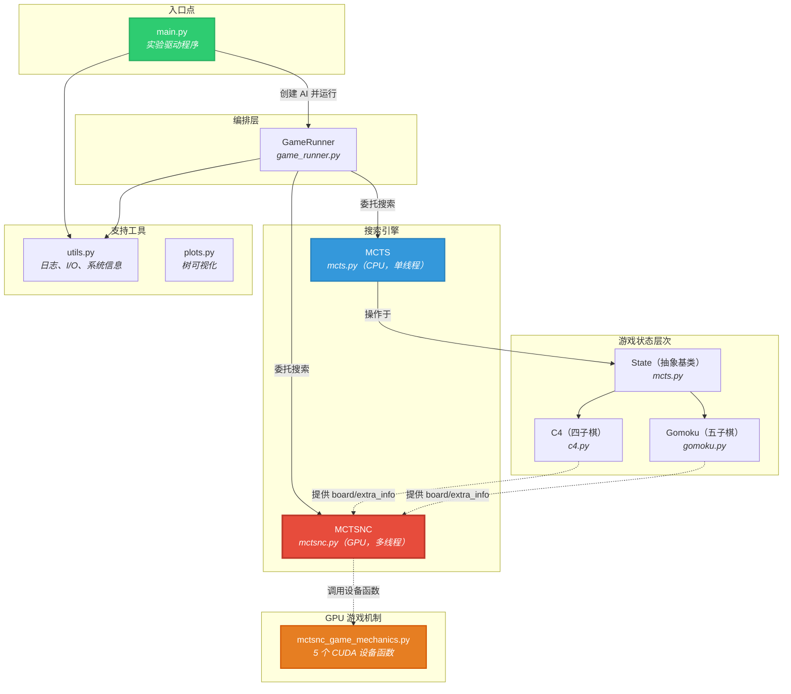

> [!IMPORTANT]
> **关键执行路径**为：`main.py` → `GameRunner.run()` → `MCTSNC.run()` → CUDA Kernels。GPU 路径（`MCTSNC`）是性能瓶颈所在，承担了 99% 以上的计算时间。

---

## 2. 类层次结构与接口契约

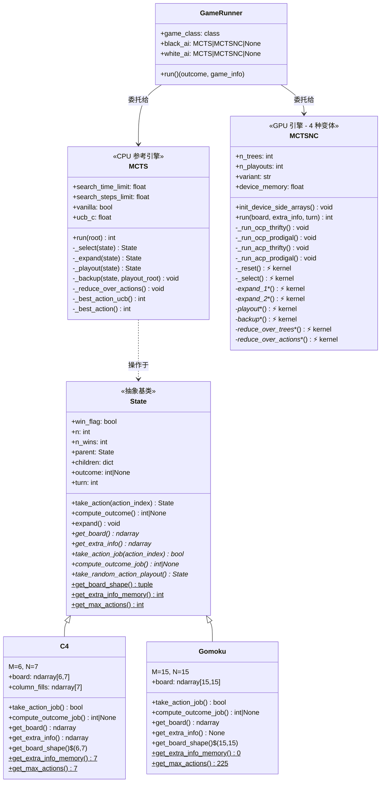

---

## 3. 实验执行流程——完整游戏生命周期

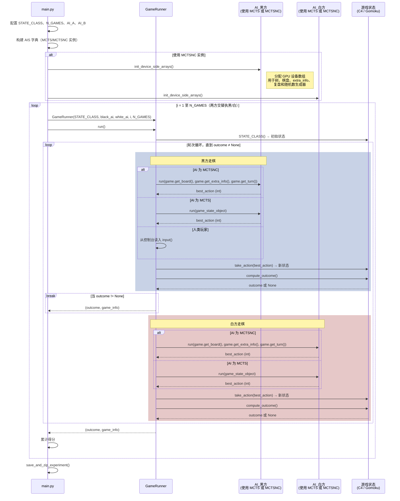

> [!NOTE]
> 接口的关键区别在于：**MCTS** 接收完整的 `State` 对象（Python 层树结构）；而 **MCTSNC** 只接收原始的 `board`（ndarray）、`extra_info`（ndarray）和 `turn`（int）——将 GPU 引擎与 Python 对象图解耦。

---

## 4. CPU MCTS——单线程参考算法

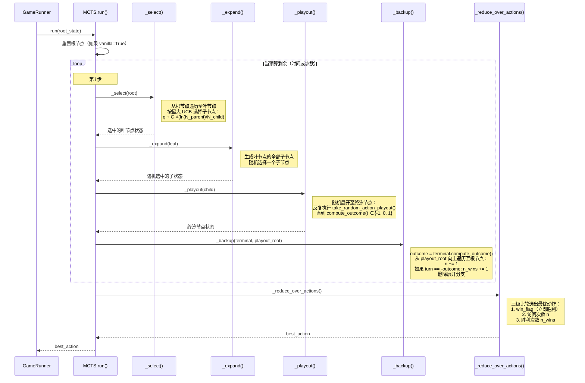

---

## 4b. MCTS 算法——流程图与伪代码

### 4b.1 标准 (CPU) MCTS 流程图

```mermaid
flowchart TD
    START([MCTS.run&#40;root&#41;]) --> INIT["初始化根节点状态<br/><i>if vanilla: 重置 n=0, children={}</i>"]
    INIT --> CHECK{预算是否剩余？<br/><i>time &lt; limit AND<br/>steps &lt; limit</i>}

    CHECK -->|No| REDUCE["<b>动作选择 (REDUCE)</b><br/>按如下标准比较根节点子节点：<br/>1. win_flag &#40;最高优先级&#41;<br/>2. 访问次数 n<br/>3. 胜利次数 n_wins"]
    REDUCE --> RETURN([返回 best_action])

    CHECK -->|Yes| SELECT["<b>① 选择 (SELECTION)</b><br/>state ← root<br/><b>while</b> state 有子节点：<br/>&nbsp;&nbsp;计算每个子节点的 UCB：<br/>&nbsp;&nbsp;&nbsp;&nbsp;ucb = q + C·√&#40;ln&#40;N_parent&#41;/N_child&#41;<br/>&nbsp;&nbsp;state ← 最大 UCB 子节点"]

    SELECT --> EXPAND["<b>② 扩展 (EXPANSION)</b><br/>为叶节点生成所有子节点<br/>对每个合法动作 a 调用 take_action&#40;a&#41;<br/>随机选择一个子节点"]

    EXPAND --> PLAYOUT["<b>③ 展开 (PLAYOUT)</b><br/><b>while</b> outcome 为 None：<br/>&nbsp;&nbsp;state ← take_random_action_playout&#40;&#41;<br/>&nbsp;&nbsp;outcome ← compute_outcome&#40;&#41;<br/><i>outcome ∈ {-1, 0, +1}</i>"]

    PLAYOUT --> BACKUP["<b>④ 备份 (BACKUP)</b><br/>outcome ← terminal.compute_outcome&#40;&#41;<br/><b>for</b> 从 playout_root 至 root 的每个祖先节点：<br/>&nbsp;&nbsp;n += 1<br/>&nbsp;&nbsp;<b>if</b> turn == -outcome: n_wins += 1<br/>删除展开分支"]

    BACKUP --> STEP["steps += 1"]
    STEP --> CHECK

    style SELECT fill:#3498db,color:#fff,stroke:#2980b9,stroke-width:2px
    style EXPAND fill:#9b59b6,color:#fff,stroke:#8e44ad,stroke-width:2px
    style PLAYOUT fill:#e74c3c,color:#fff,stroke:#c0392b,stroke-width:2px
    style BACKUP fill:#2ecc71,color:#fff,stroke:#27ae60,stroke-width:2px
    style REDUCE fill:#f39c12,color:#fff,stroke:#e67e22,stroke-width:2px
```

### 4b.2 标准 (CPU) MCTS 伪代码

```
算法： MCTS（CPU，单线程）
═══════════════════════════════════════════════════════════════

输入：  root        — 根状态对象
        time_limit  — 搜索时间预算（秒）
        steps_limit — 搜索步数预算
        ucb_c       — 探索常数（默认 2.0）
        vanilla     — 如果为 True，丢弃之前的搜索树
输出： best_action — 根节点最优动作的索引

─────────────────────────────────────────────────────────────
函数 MCTS.run(root):
    如果 vanilla:
        root.n ← 0
        root.children ← {}

    steps ← 0
    t_start ← current_time()

    ┌─ 主循环 ─────────────────────────────────────────────────
    │  while steps < steps_limit AND elapsed(t_start) < time_limit:
    │
    │      ┌─ ① 选择 (SELECTION) ────────────────────────────────────
    │      │  state ← root
    │      │  while state.children ≠ ∅:
    │      │      for each child c in state.children:
    │      │          q ← c.n_wins / c.n
    │      │          ucb(c) ← q + ucb_c · √(ln(state.n) / c.n)
    │      │      state ← argmax_c ucb(c)
    │      └────────────────────────────── 返回: 叶节点 ───┘
    │
    │      ┌─ ② 扩展 (EXPANSION) ─────────────────────────────────
    │      │  if leaf 非终汐且 leaf.children = ∅:
    │      │      for a = 0 to max_actions - 1:
    │      │          child ← leaf.take_action(a)    // skip illegal
    │      │      state ← random_choice(leaf.children)
    │      └────────────────────── 返回: 随机子节点 c ──┘
    │
    │      ┌─ ③ 展开 (PLAYOUT / 随机展开) ─────────────────────
    │      │  playout_root ← state
    │      │  while state.compute_outcome() = None:
    │      │      state ← state.take_random_action_playout()
    │      └────────────────────── 返回: 终汐状态 ──┘
    │
    │      ┌─ ④ 备份 (BACKUP) ───────────────────────────────────
    │      │  outcome ← terminal.compute_outcome()  // ∈ {-1, 0, +1}
    │      │  node ← playout_root
    │      │  delete node.children           // 剪除展开分支
    │      │  while node ≠ null:
    │      │      node.n ← node.n + 1
    │      │      if node.turn = -outcome:
    │      │          node.n_wins ← node.n_wins + 1
    │      │      node ← node.parent
    │      └─────────────────────────────────────────────────┘
    │
    │      steps ← steps + 1
    └───────────────────────────────────── 主循环结束 ────┘

    ┌─ 逗动作加成 (REDUCE OVER ACTIONS) ───────────────────────
    │  for each child c of root:
    │      record (c.win_flag, c.n, c.n_wins)
    │  best_action ← argmax 按三级比较：
    │      第1位: win_flag   (True > False)
    │      第2位: n          (越大越好)
    │      第3位: n_wins     (越大越好)
    └──────────────────────────────── 返回: best_action ────┘

    return best_action
```

### 4b.3 GPU MCTSNC Flowchart (acp_prodigal Variant)

```mermaid
flowchart TD
    START([MCTSNC.run&#40;board, extra_info, turn&#41;]) --> H2D["<b>主机 → 设备</b><br/>cuda.to_device&#40;root_board&#41;<br/>cuda.to_device&#40;root_extra_info&#41;"]

    H2D --> RESET["⚡ <b>_reset</b> kernel<br/>bpg = n_trees<br/>将所有树初始化为根状态<br/>将 board/extra_info 复制到每棵树"]
    RESET --> CHECK{预算是否剩余？<br/><i>time &lt; limit AND<br/>steps &lt; limit</i>}

    CHECK -->|No| ROT["⚡ <b>_reduce_over_trees</b><br/>bpg = max_actions<br/>逗每个动作在所有树中求和 n、n_wins<br/>检查终汐子节点的 win_flags"]
    ROT --> ROA["⚡ <b>_reduce_over_actions</b><br/>bpg = 1, tpb = max_actions<br/>Max-argmax 加成：<br/>1. win_flag → 2. n → 3. n_wins"]
    ROA --> D2H["<b>设备 → 主机</b><br/>拷贝 best_action, best_n, best_n_wins"]
    D2H --> RETURN([返回 best_action])

    CHECK -->|Yes| SELECT["⚡ <b>① _select</b><br/>bpg = n_trees, tpb = 512<br/>每个 block: 一棵树<br/>通过共享内存加成进行 UCB 树遍历<br/>将路径存入 trees_selected_paths"]

    SELECT --> EXP1["⚡ <b>② _expand_1_acp</b><br/>bpg = n_trees<br/>对每个动作 t 检查 is_action_legal<br/>前缀和 → 分配子节点索引<br/>对所有子节点设置 fake_child = -2 &#40;ACP&#41;"]

    EXP1 --> MEM{"step == 0?"}
    MEM -->|Yes| MEMK["⚡ _memorize_root_actions_expanded"]
    MEMK --> EXP2
    MEM -->|No| EXP2

    EXP2["⚡ <b>② _expand_2_prodigal</b><br/>bpg = &#40;n_trees, max_actions&#41;<br/>每个&#40;树, 动作&#41; block：<br/>跳过非法动作（早返回）<br/>拷贝父棋盘 → take_action → 子节点插槽<br/>设置 turn, depth, leaf=T, terminal 标识"]

    EXP2 --> PLAY["⚡ <b>③ _playout_acp_prodigal</b><br/>bpg = &#40;n_trees, max_actions&#41;, tpb = n_playouts<br/>每个 block: 跳过非法或终汐动作<br/>每个线程: 独立随机展开<br/>  board → legal_actions → 随机选择 → 重复<br/>求和加成 → playout_outcomes_children"]

    PLAY --> BK1["⚡ <b>④ _backup_1_acp_prodigal</b><br/>bpg = n_trees<br/>更新子节点: ns += n_playouts, ns_wins += wins<br/>对所有子节点结果求和加成 → 汇总"]
    BK1 --> BK2["⚡ <b>④ _backup_2_acp</b><br/>bpg = n_trees<br/>沿 selected_path 向上遍历：<br/>  ns += n_playouts × n_expanded<br/>  ns_wins += 汇总胜利次数"]

    BK2 --> STEP["steps += 1"]
    STEP --> CHECK

    style SELECT fill:#3498db,color:#fff,stroke:#2980b9,stroke-width:2px
    style EXP1 fill:#9b59b6,color:#fff,stroke:#8e44ad,stroke-width:2px
    style EXP2 fill:#9b59b6,color:#fff,stroke:#8e44ad,stroke-width:2px
    style PLAY fill:#e74c3c,color:#fff,stroke:#c0392b,stroke-width:2px
    style BK1 fill:#2ecc71,color:#fff,stroke:#27ae60,stroke-width:2px
    style BK2 fill:#2ecc71,color:#fff,stroke:#27ae60,stroke-width:2px
    style ROT fill:#f39c12,color:#fff,stroke:#e67e22,stroke-width:2px
    style ROA fill:#f39c12,color:#fff,stroke:#e67e22,stroke-width:2px
    style RESET fill:#95a5a6,color:#fff,stroke:#7f8c8d,stroke-width:2px
```

### 4b.4 GPU MCTSNC 伪代码（acp_prodigal 变体）

```
算法：MCTSNC — GPU 并行 MCTS (acp_prodigal)
═══════════════════════════════════════════════════════════════

输入：  root_board[M,N]        — 二维游戏棋盘（int8）
        root_extra_info[E]     — 辅助状态信息（int8）
        root_turn ∈ {-1, +1}   — 当前行棋方
        n_trees                — 独立搜索树数量
        n_playouts             — 每个（树, 动作）的展开次数
        max_actions            — 最大分支因子
        max_tree_size          — 预分配树容量
        ucb_c                  — 探索常数
输出：  best_action            — 最佳动作的索引

说明：  ⚡ = CUDA kernel；bpg = 每网格块数；tpb = 每块线程数
───────────────────────────────────────────────────────────────

函数 MCTSNC.run(root_board, root_extra_info, root_turn):

    ┌─ 初始化 ────────────────────────────────────────────────
    │  dev_board     ← cuda.to_device(root_board)
    │  dev_extra     ← cuda.to_device(root_extra_info)
    │
    │  ⚡ _reset [bpg=n_trees, tpb=tpb_r]:
    │      对每棵树 ti（每棵树一个 CUDA block）：
    │          trees[ti, 0] ← 根节点
    │          trees_sizes[ti] ← 1
    │          trees_depths[ti, 0] ← 0
    │          trees_turns[ti, 0] ← root_turn
    │          trees_leaves[ti, 0] ← True
    │          trees_terminals[ti, 0] ← False
    │          // 所有线程协作复制 board 和 extra_info
    │          trees_boards[ti, 0] ← dev_board
    │          trees_extra_infos[ti, 0] ← dev_extra
    │  cuda.synchronize()
    └────────────────────────────────────────────────────────┘

    steps ← 0

    ┌─ 主搜索循环 ────────────────────────────────────────────
    │  while steps < steps_limit AND elapsed < time_limit:
    │
    │  ┌─ ① 选择 ⚡ _select [bpg=n_trees, tpb=512] ──────────
    │  │  对每棵树 ti（一个 CUDA block）：
    │  │      node ← 0（根节点）
    │  │      path_length ← 0
    │  │      while trees_leaves[ti, node] = False：
    │  │          // 通过共享内存计算 UCB
    │  │          for each child c of node（并行线程）：
    │  │              shared_ucbs[t] ← q(c) + C·√(ln(N_parent)/N_c)
    │  │          // 共享内存中 max-argmax 加成
    │  │          best_child ← argmax(shared_ucbs)
    │  │          trees_selected_paths[ti, path_length] ← node
    │  │          node ← trees[ti, node, 1 + best_child]
    │  │          path_length += 1
    │  │      trees_nodes_selected[ti] ← node
    │  │      trees_selected_paths[ti, path_length] ← node
    │  │  cuda.synchronize()
    │  └─────────────────────────────────────────────────────┘
    │
    │  ┌─ ② 扩展 — 子阶段 1 ─────────────────────────────────
    │  │  ⚡ _expand_1_acp_prodigal [bpg=n_trees, tpb=tpb_e1]：
    │  │  对每棵树 ti：
    │  │      selected ← trees_nodes_selected[ti]
    │  │      if trees_terminals[ti, selected]：
    │  │          跳过（标记扩展动作数为 0）
    │  │      // 将选中节点的棋盘加载到共享内存
    │  │      for each action a（并行线程）：
    │  │          legal[a] ← is_action_legal(board, extra_info, turn, a)
    │  │      // 线程 0：对合法动作做前缀和
    │  │      n_expanded ← count(legal)
    │  │      if trees_sizes[ti] + n_expanded > max_tree_size：
    │  │          跳过（无空间）
    │  │      for each legal action a：
    │  │          child_idx ← trees_sizes[ti] + shift
    │  │          trees[ti, selected, 1+a] ← child_idx  // 父→子
    │  │          trees[ti, child_idx, 0] ← selected     // 子→父
    │  │          trees_actions_expanded[ti, shift] ← a
    │  │      trees_actions_expanded[ti, -2] ← -2        // ACP: 全部子节点
    │  │      trees_actions_expanded[ti, -1] ← n_expanded
    │  │      trees_sizes[ti] += n_expanded
    │  │      trees_leaves[ti, selected] ← False
    │  │  cuda.synchronize()
    │  │
    │  │  if step = 0：
    │  │      ⚡ _memorize_root_actions_expanded：
    │  │          root_actions_expanded ← trees_actions_expanded[0]
    │  │      cuda.synchronize()
    │  └─────────────────────────────────────────────────────┘
    │
    │  ┌─ ② 扩展 — 子阶段 2 ─────────────────────────────────
    │  │  ⚡ _expand_2_prodigal [bpg=(n_trees, max_actions), tpb=tpb_e2]：
    │  │  对每个（树 ti, 动作 aj）— 一个 CUDA block：
    │  │      if action aj 非法：提前返回（prodigal）
    │  │      child_idx ← trees[ti, selected, 1+aj]
    │  │      // 将父棋盘复制到共享内存
    │  │      shared_board ← trees_boards[ti, selected]
    │  │      // 线程 0：修改棋盘
    │  │      take_action(shared_board, extra_info, turn, aj)
    │  │      // 所有线程：写回全局内存
    │  │      trees_boards[ti, child_idx] ← shared_board
    │  │      trees_extra_infos[ti, child_idx] ← shared_extra
    │  │      // 线程 0：完成子节点初始化
    │  │      trees_turns[ti, child_idx] ← -turn
    │  │      trees_leaves[ti, child_idx] ← True
    │  │      trees_depths[ti, child_idx] ← parent_depth + 1
    │  │      outcome ← compute_outcome(board, turn, aj)
    │  │      trees_terminals[ti, child_idx] ← (outcome ≠ ONGOING)
    │  │      trees_outcomes[ti, child_idx] ← outcome
    │  │  cuda.synchronize()
    │  └─────────────────────────────────────────────────────┘
    │
    │  ┌─ ③ 展开 ⚡ [bpg=(n_trees, max_actions), tpb=n_playouts]
    │  │  对每个（树 ti, 动作 aj）— 一个 CUDA block：
    │  │      if action aj 非法：提前返回（prodigal）
    │  │      child_idx ← trees[ti, selected, 1+aj]
    │  │      if trees_terminals[ti, child_idx]：
    │  │          // 终局：outcome × n_playouts
    │  │          记录到 playout_outcomes_children[ti, aj]
    │  │          return
    │  │      // 每个线程（展开 p，范围 0..n_playouts-1）：
    │  │      local_board ← 子节点棋盘副本
    │  │      cur_turn ← 子节点行棋方
    │  │      循环：
    │  │          legal_actions_playout(local_board, ..., legal_list)
    │  │          rand_idx ← xoroshiro128p_random() mod legal_count
    │  │          take_action_playout(local_board, ..., legal_list[rand_idx])
    │  │          outcome ← compute_outcome(local_board, cur_turn, action)
    │  │          if outcome ≠ ONGOING: break
    │  │          cur_turn ← -cur_turn
    │  │      shared_outcomes[p] ← outcome
    │  │      // 对 n_playouts 线程做求和加成：
    │  │      total_neg ← Σ(outcome = -1)
    │  │      total_pos ← Σ(outcome = +1)
    │  │      playout_outcomes_children[ti, aj] ← (total_neg, total_pos)
    │  │  cuda.synchronize()
    │  └─────────────────────────────────────────────────────┘
    │
    │  ┌─ ④ 备份 — 子阶段 1 ─────────────────────────────────
    │  │  ⚡ _backup_1_acp_prodigal [bpg=n_trees, tpb=tpb_b1]：
    │  │  对每棵树 ti：
    │  │      for each expanded action a（并行线程）：
    │  │          child ← trees[ti, selected, 1+a]
    │  │          trees_ns[ti, child] += n_playouts
    │  │          wins ← playout_outcomes_children[ti, a]（匹配行棋方）
    │  │          trees_ns_wins[ti, child] += wins
    │  │      // 求和加成：汇总所有子节点结果
    │  │      trees_playout_outcomes[ti] ← 所有子节点之和
    │  │  cuda.synchronize()
    │  └─────────────────────────────────────────────────────┘
    │
    │  ┌─ ④ 备份 — 子阶段 2 ─────────────────────────────────
    │  │  ⚡ _backup_2_acp [bpg=n_trees, tpb=tpb_b2]：
    │  │  对每棵树 ti：
    │  │      n_expanded ← trees_actions_expanded[ti, -1]
    │  │      total_playouts ← n_playouts × n_expanded
    │  │      agg_wins ← trees_playout_outcomes[ti]
    │  │      for each ancestor node in selected_path[ti]（从下向上）：
    │  │          trees_ns[ti, node] += total_playouts
    │  │          // 按节点视角累加胜利次数
    │  │          if trees_turns[ti, node] = -1：
    │  │              trees_ns_wins[ti, node] += agg_wins.neg
    │  │          else：
    │  │              trees_ns_wins[ti, node] += agg_wins.pos
    │  │  cuda.synchronize()
    │  └─────────────────────────────────────────────────────┘
    │
    │  steps += 1
    └──────────────────────────────── 主循环结束 ─────────────┘

    ┌─ 循环后：对树做加成 (REDUCE OVER TREES) ─────────────────
    │  ⚡ _reduce_over_trees_prodigal [bpg=max_actions, tpb=tpb_rot]：
    │  对每个根动作 a（一个 CUDA block）：
    │      // 每个线程 = 一棵树
    │      shared_ns[t] ← trees_ns[t, root_child_a]
    │      shared_ns_wins[t] ← trees_ns_wins[t, root_child_a]
    │      // 跨树的求和加成
    │      actions_ns[a] ← Σ shared_ns
    │      actions_ns_wins[a] ← Σ shared_ns_wins
    │      // 检查终局子节点的 win_flags
    │      actions_win_flags[a] ← OR（胜利的终局节点）
    │  cuda.synchronize()
    └────────────────────────────────────────────────────────┘

    ┌─ 循环后：对动作做加成 (REDUCE OVER ACTIONS) ──────────────
    │  ⚡ _reduce_over_actions_prodigal [bpg=1, tpb=max_actions]：
    │  // 对所有动作做 max-argmax 加成
    │  for each action a（一个线程）：
    │      shared ← (win_flag[a], ns[a], ns_wins[a])
    │  // 三级比较器并行加成：
    │  //   第1位：win_flag（True > False）
    │  //   第2位：ns（越大越好）
    │  //   第3位：ns_wins（越大越好）
    │  best_action ← 按三级比较的 argmax
    │  cuda.synchronize()
    └────────────────────────────────────────────────────────┘

    best_action, best_n, best_n_wins ← copy_to_host()
    return best_action
```

> [!NOTE]
> **ocp**（单子节点展开）变体在展开和备份阶段有所不同：只有随机选中的一个子节点接受展开，备份也只有单次传播。**thrifty** 变体在主循环内增加了一次主机-设备往返（`copy_to_host` + Python reshape + `to_device`）以精确计算块数，而 **prodigal** 变体则过量分配块、对非法动作使用早返回。

---

## 5. GPU MCTSNC —— Kernel 流水线详解（核心算法）

### 5.1 四种算法变体

| 变体 | 展开范围 | 块分配方式 | 说明 |
|---|---|---|---|
| **ocp_thrifty** | **O**ne **C**hild **P**layouts | 精确块数 = 合法动作数 | 对 1 个随机子节点展开；GPU 块数最少 |
| **ocp_prodigal** | **O**ne **C**hild **P**layouts | `max_actions` 个块（部分空闲） | 对 1 个随机子节点展开；过量分配块 |
| **acp_thrifty** | **A**ll **C**hildren **P**layouts | 精确块数 = 合法动作数 | 对所有扩展子节点展开；块数最少 |
| **acp_prodigal** | **A**ll **C**hildren **P**layouts | `max_actions` 个块（部分空闲） | 对所有子节点展开；过量分配块 |

> [!TIP]
> **Prodigal** 变体用 GPU 占用率开销换取了消除主机端 `_flatten_trees_actions_expanded_thrifty()` 拷贝 + reshape 步骤。**ACP** 变体每步提供更好的价値估计，但总展开次数更多。

### 5.2 GPU 内存布局（设备端数组）

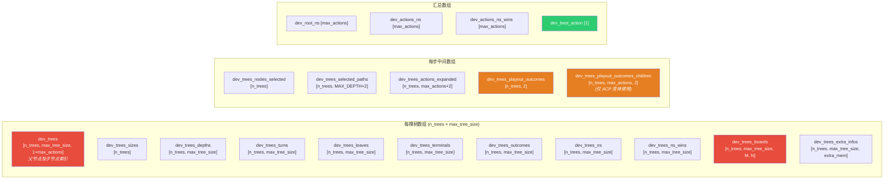

### 5.3 MCTSNC Kernel 流水线——ACP Prodigal 变体（详细时序）

这是默认且**并行化程度最高**的变体（`acp_prodigal`）。其他变体遵循相同骨架，仅在块网格尺寸和展开范围上有所不同。

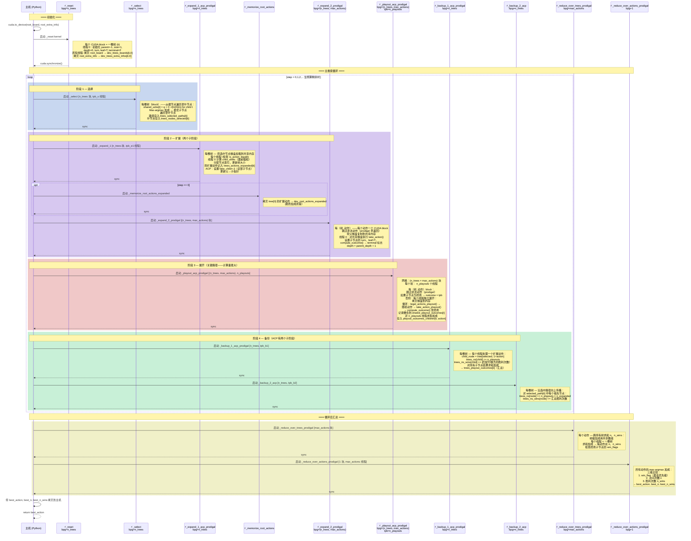

### 5.4 变体差异——Kernel 网格配置比较

```mermaid
graph TD
    subgraph "OCP 变体（单子节点展开）"
        OCP_E1_T["expand_1: bpg=n_trees<br/><i>随机选择 1 个子节点</i>"]
        OCP_E2_T["expand_2_thrifty: bpg=Σ(legal actions)"]
        OCP_E2_P["expand_2_prodigal: bpg=(n_trees, max_actions)"]
        OCP_PL["playout_ocp: bpg=n_trees, tpb=n_playouts<br/><i>仅对 1 个随机子节点展开</i>"]
        OCP_BK["backup_ocp: bpg=n_trees<br/><i>单次备份传播</i>"]
    end

    subgraph "ACP 变体（全子节点展开）"
        ACP_E1_T["expand_1: bpg=n_trees<br/><i>所有子节点标记</i>"]
        ACP_E2_T["expand_2_thrifty: bpg=Σ(legal actions)"]
        ACP_E2_P["expand_2_prodigal: bpg=(n_trees, max_actions)"]
        ACP_PL_T["playout_acp_thrifty: bpg=Σ(legal), tpb=n_playouts<br/><i>对所有子节点展开</i>"]
        ACP_PL_P["playout_acp_prodigal: bpg=(n_trees, max_actions), tpb=n_playouts<br/><i>对所有子节点展开</i>"]
        ACP_BK1["backup_1_acp: bpg=n_trees<br/><i>更新子节点 + 加成</i>"]
        ACP_BK2["backup_2_acp: bpg=n_trees<br/><i>沿选中路径向上传播</i>"]
    end

    OCP_E1_T --> OCP_E2_T
    OCP_E1_T --> OCP_E2_P
    OCP_E2_T --> OCP_PL
    OCP_E2_P --> OCP_PL
    OCP_PL --> OCP_BK

    ACP_E1_T --> ACP_E2_T
    ACP_E1_T --> ACP_E2_P
    ACP_E2_T --> ACP_PL_T
    ACP_E2_P --> ACP_PL_P
    ACP_PL_T --> ACP_BK1
    ACP_PL_P --> ACP_BK1
    ACP_BK1 --> ACP_BK2

    style OCP_PL fill:#3498db,color:#fff
    style ACP_PL_P fill:#e74c3c,color:#fff
    style ACP_PL_T fill:#e74c3c,color:#fff
```

### 5.5 Thrifty 与 Prodigal ——主机-设备数据流对比

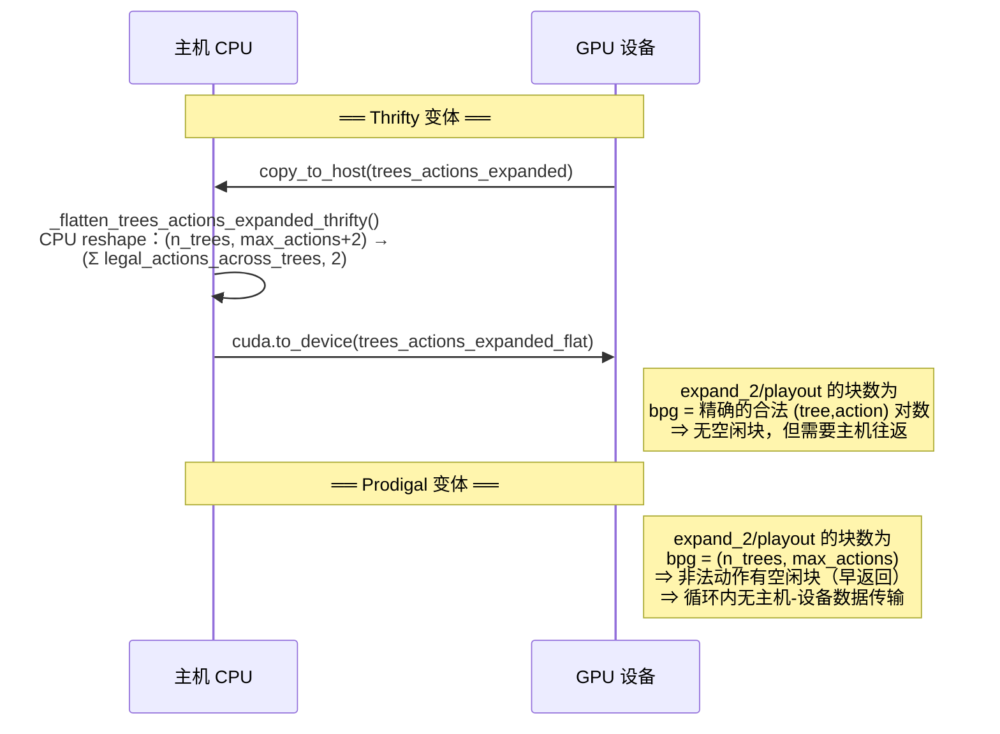

> [!WARNING]
> **Thrifty** 变体在主循环内引入了**主机-设备同步点**（`copy_to_host` + Python reshape + `to_device`）。当 `n_trees` 或 `max_actions` 较大时，这会成为瓶颈。**Prodigal** 变体以启动空闲 CUDA 块为代价避免了这一问题。

---

## 6. 游戏机制设备函数——MCTSNC ↔ mctsnc_game_mechanics 接口

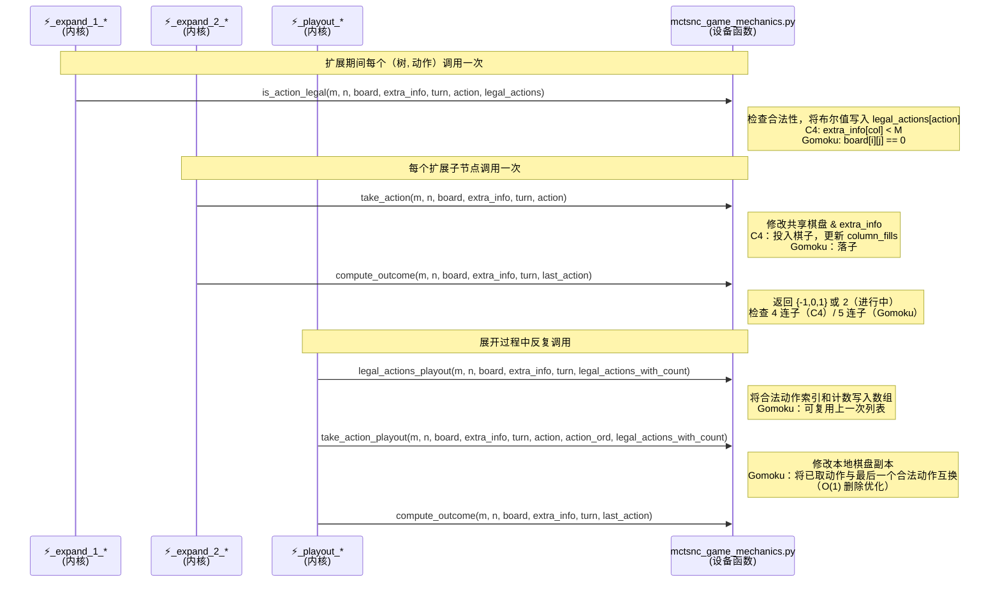

> [!TIP]
> 要接入**新游戏**，只需在 `mctsnc_game_mechanics.py` 中实现这 5 个设备函数，并实现对应的 `State` 子类。Gomoku 实现展示了一项优化：`take_action_playout_gomoku` 通过与最后元素互换实现 O(1) 合法动作列表删除，避免重新生成。

---

## 7. GPU 线程级并行架构

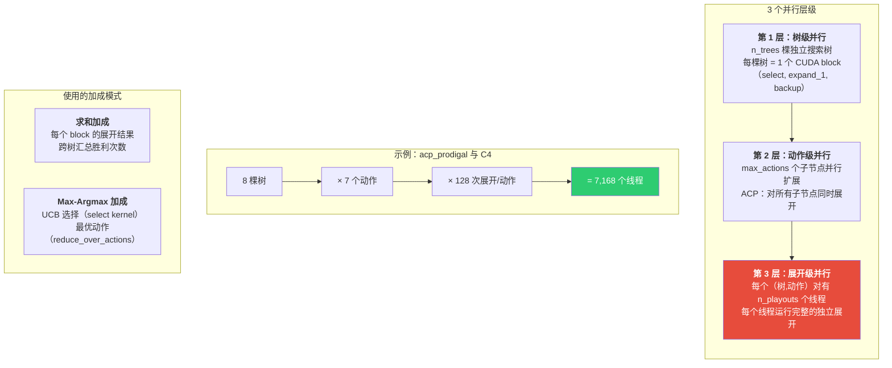

---

## 8. 数据流汇总——端到端

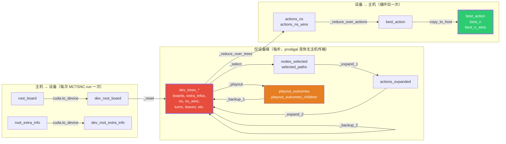

> [!IMPORTANT]
> **主机-设备传输最少化**：仅根状态从主机传向设备，仅最优动作从设备返回主机。所有中间树操作完全在 GPU 上运行。这是实现高吞吐量（Gomoku 上可达 ~18M 次展开/秒）的关键设计原则。

---

## 9. CUDA Kernel 目录与共享内存数据结构

| Kernel | 功能 | 网格 (bpg) | 块 (tpb) | 共享内存 |
|---|---|---|---|---|
| `_reset` | 将所有树初始化为根状态 | `n_trees` | `tpb_r` | — |
| `_select` | 基于 UCB 的树遍历到叶节点 | `n_trees` | `tpb_s` (512) | `ucbs[512]`, `best_child[512]`, `path[2050]` |
| `_expand_1_*` | 检查合法动作，分配子节点索引 | `n_trees` | `tpb_e1` | `board[32×32]`, `extra_info[4096]`, `legal[512]` |
| `_expand_2_thrifty` | 创建子节点（棋盘拷贝 + take_action） | `Σ legal_actions` | `tpb_e2` | `board[32×32]`, `extra_info[4096]` |
| `_expand_2_prodigal` | 创建子节点（每个动作一个 block） | `(n_trees, max_actions)` | `tpb_e2` | `board[32×32]`, `extra_info[4096]` |
| `_playout_ocp` | 每棵树对 1 个子节点展开 | `n_trees` | `n_playouts` | `board[32×32]`, `extra_info[4096]`, `outcomes[512×2]` |
| `_playout_acp_thrifty` | 对所有子节点展开（thrifty 网格） | `Σ legal_actions` | `n_playouts` | 同上 |
| `_playout_acp_prodigal` | 对所有子节点展开（prodigal 网格） | `(n_trees, max_actions)` | `n_playouts` | 同上 |
| `_backup_ocp` | 更新路径 + 子节点统计信息 | `n_trees` | `tpb_b2` | — |
| `_backup_1_acp_*` | 更新所有扩展子节点 + 加成 | `n_trees` | `tpb_b1` | `outcomes_children[512×2]` |
| `_backup_2_acp` | 汇总结果沿选中路径向上传播 | `n_trees` | `tpb_b2` | — |
| `_reduce_over_trees_*` | 每个动作跨树求和 n、n_wins | `n_root_actions` / `max_actions` | `tpb_rot` | `root_ns[512]`, `ns[512]`, `ns_wins[512]` |
| `_reduce_over_actions_*` | 找最优动作（max-argmax） | `1` | `tpb_roa` | `actions[512]`, `flags[512]`, `ns[512]`, `ns_wins[512]` |

---

## 10. Kernel 使用的设备端数据结构

每个 CUDA kernel 通过全局内存访问下列设备端数组。所有数组均受 `init_device_side_arrays()` 分配。

### 10.1 数组元素类型与字节大小

| 数据类型 | NumPy dtype | 字节大小 | 用途 |
|---|---|---|---|
| 节点索引 | `np.int32` | 4 B | 树结构中父/子节点引用 |
| 动作索引 | `np.int16` | 2 B | `trees_actions_expanded` 节省内存 |
| 棋盘元素 | `np.int8` | 1 B | 棋盘和 extra_info |
| 深度 | `np.int16` | 2 B | 树节点深度 |
| 树大小 | `np.int32` | 4 B | 当前树的节点数量 |
| 行棋方 | `np.int8` | 1 B | -1 或 +1 |
| 标志位 | `bool` | 1 B | 叶节点/终局节点标志 |
| 结果 | `np.int8` | 1 B | -1/0/+1/2（进行中） |
| 访问/胜利次数 | `np.int32` | 4 B | 逐节点统计 |
| 汇总访问/胜利 | `np.int64` | 8 B | 跨树汇总结果 |
| 展开结果 | `np.int32` | 4 B | 负/正展开计数 |

### 10.2 全局内存设备端数组详表

| 数组名称 | 形状 | 元素类型 | 各 kernel 访问方式 | 说明 |
|---|---|---|---|---|
| `dev_trees` | `[n_trees, max_tree_size, 1+max_actions]` | `int32` | 读写 | 节点树：`[0]`=父节点, `[1..max_actions]`=子节点; -1 表示无 |
| `dev_trees_sizes` | `[n_trees]` | `int32` | 读写 | 每棵树当前节点数 |
| `dev_trees_depths` | `[n_trees, max_tree_size]` | `int16` | 读写 | 每节点在树中的深度 |
| `dev_trees_turns` | `[n_trees, max_tree_size]` | `int8` | 读/写 | 节点处行棋方 (-1 或 +1) |
| `dev_trees_leaves` | `[n_trees, max_tree_size]` | `bool` | 读写 | True 表示叶节点（未扩展） |
| `dev_trees_terminals` | `[n_trees, max_tree_size]` | `bool` | 读写 | True 表示终局节点 |
| `dev_trees_outcomes` | `[n_trees, max_tree_size]` | `int8` | 读写 | 终局节点结果 (-1/0/+1) |
| `dev_trees_ns` | `[n_trees, max_tree_size]` | `int32` | 读写 | 每节点访问次数 |
| `dev_trees_ns_wins` | `[n_trees, max_tree_size]` | `int32` | 读写 | 每节点胜利次数 |
| `dev_trees_boards` | `[n_trees, max_tree_size, M, N]` | `int8` | 读写 | 每节点棋盘状态（最大 32×32） |
| `dev_trees_extra_infos` | `[n_trees, max_tree_size, extra_mem]` | `int8` | 读写 | 每节点辅助信息（最大 4096 B） |
| `dev_trees_nodes_selected` | `[n_trees]` | `int32` | 读写 | 每棵树当前步选中的节点索引 |
| `dev_trees_selected_paths` | `[n_trees, MAX_DEPTH+2]` | `int32` | 读写 | 当前步的选择路径 |
| `dev_trees_actions_expanded` | `[n_trees, max_actions+2]` | `int16` | 读写 | 当前步扩展的动作列表；`[-2]`=ocp随机子/-2(全部); `[-1]`=n_expanded |
| `dev_trees_playout_outcomes` | `[n_trees, 2]` | `int32` | 读写 | 汇总展开结果：`[0]`=-1胜次数, `[1]`=+1胜次数 |
| `dev_trees_playout_outcomes_children` | `[n_trees, max_actions, 2]` | `int32` | 读写 | 仅 ACP：每子节点的展开结果 |
| `dev_random_generators_playout` | `xoroshiro128p` 状态 | 内部 | 读写 | 展开随机数生成器 |
| `dev_random_generators_expand_1` | `xoroshiro128p` 状态 | 内部 | 读写 | 仅 OCP：expand_1 随机数生成器 |
| `dev_root_actions_expanded` | `[max_actions+2]` | `int16` | 只读 | 第 0 步从 tree[0] 备忘的根动作（供 reduce 使用） |
| `dev_root_ns` | `[max_actions]` | `int64` | 写 | 内核读取的根访问次数 |
| `dev_actions_win_flags` | `[max_actions]` | `bool` | 写 | 每动作是否存在立即胜利终局子节点 |
| `dev_actions_ns` | `[max_actions]` | `int64` | 写 | 跨树汇总访问次数 |
| `dev_actions_ns_wins` | `[max_actions]` | `int64` | 写 | 跨树汇总胜利次数 |
| `dev_best_action` | `[1]` | `int16` | 写 | 最优动作索引 |
| `dev_best_win_flag` | `[1]` | `bool` | 写 | 最优动作是否有立即胜利标志 |
| `dev_best_n` / `dev_best_n_wins` | `[1]` | `int64` | 写 | 最优动作的访问/胜利次数 |

### 10.3 共享内存结构（所有 kernel 内部使用）

共享内存（shared memory）是每个 CUDA block 内线程共享的快速临时缓存。各 kernel 所使用的共享内存结构如下：

| Kernel | 共享内存结构名称 | 最大大小 | 用途 |
|---|---|---|---|
| `_reset` | 无 | — | 直接从全局内存写入 |
| `_select` | `shared_ucbs[tpb_s]` | 512×4 B | 存储每个子节点的 UCB 值 |
| | `shared_best_child[tpb_s]` | 512×4 B | Max-argmax 加成过程中指数 |
| | `shared_path[MAX_DEPTH+2]` | 2050×4 B | 选择路径临时缓存 |
| `_expand_1_*` | `shared_board[M][N]` | ≤ 32×32 B | 选中节点棋盘副本 |
| | `shared_extra_info[extra_mem]` | ≤ 4096 B | extra_info 副本 |
| | `shared_legal[max_actions]` | ≤ 512 B | 合法动作标志 |
| `_expand_2_*` | `shared_board[M][N]` | ≤ 32×32 B | 父棋盘副本（修改后写回子节点） |
| | `shared_extra_info[extra_mem]` | ≤ 4096 B | extra_info 副本 |
| `_playout_*` | `shared_board[M][N]` | ≤ 32×32 B | 展开路径棋盘副本 |
| | `shared_extra_info[extra_mem]` | ≤ 4096 B | extra_info 副本 |
| | `shared_outcomes[n_playouts][2]` | ≤ 512×2×4 B | 负/正展开结果计数 |
| `_backup_1_acp_*` | `shared_outcomes_children[max_actions][2]` | ≤ 512×2×4 B | 子节点展开结果缓存 |
| `_reduce_over_trees_*` | `shared_root_ns[tpb_rot]` | 512×8 B | 跨树访问次数加成 |
| | `shared_ns[tpb_rot]` | 512×8 B | 跨树 n 加成 |
| | `shared_ns_wins[tpb_rot]` | 512×8 B | 跨树 n_wins 加成 |
| `_reduce_over_actions_*` | `shared_actions[max_actions]` | 512×2 B | 动作索引缓存 |
| | `shared_flags[max_actions]` | 512 B | win_flag 缓存 |
| | `shared_ns[max_actions]` | 512×8 B | 访问次数缓存 |
| | `shared_ns_wins[max_actions]` | 512×8 B | 胜利次数缓存 |
